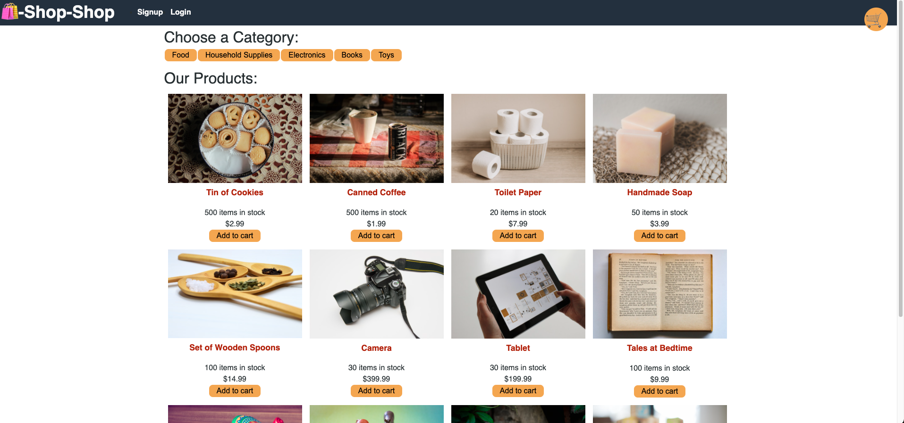

# Shop-Shop

## Table of Contents
* [Description](#description)
* [Installation](#installation)
* [Usage](#usage)
* [License](#license)
* [Contributors](#contributors)
* [Links](#links)
* [Screenshots](#screenshots)
* [Questions](#questions)

## Description:
This Shop app is desgined to give the user a full buying experience. When you go to the home screen many different types of categories will be displayed. When you click on a category type you will only see products related to that type. When you click on a single product you will be taken to a page that only includes that product. When you click add to cart the iten will be added to the cart. If you click remove from cart it will be removed. the cart will drop down when an item is added. You can delete with the trash can and increase item with arrow are buy clicking add cart again. Click checkout to berouted to a fully functional checkout page. 

## Installation:
1. Clone from Github repository.  
3. Install required npm packages:  
* react.js  
* mongodb  
* mongoose  
* graphQl  
* redux  

## Usage:
Through Local Server: 
1. Start from the terminal using npm start.  
2. Will open in browser automatically.

## License:
This Repository is covered under the following license: [ISC]

## Contributors:
Richard Flores

## Links:
Deployed Application: https://still-spire-22068.herokuapp.com/  
Github Repository: https://github.com/Richardflores009/shop-shop  

## Screenshots:

## Questions:
Contact me: 
Github: [https://github.com/Richardflores009](https://github.com/Richardflores009) 
Email: [richardflores009@gmail.com](richardflores009@gmail.com) 
